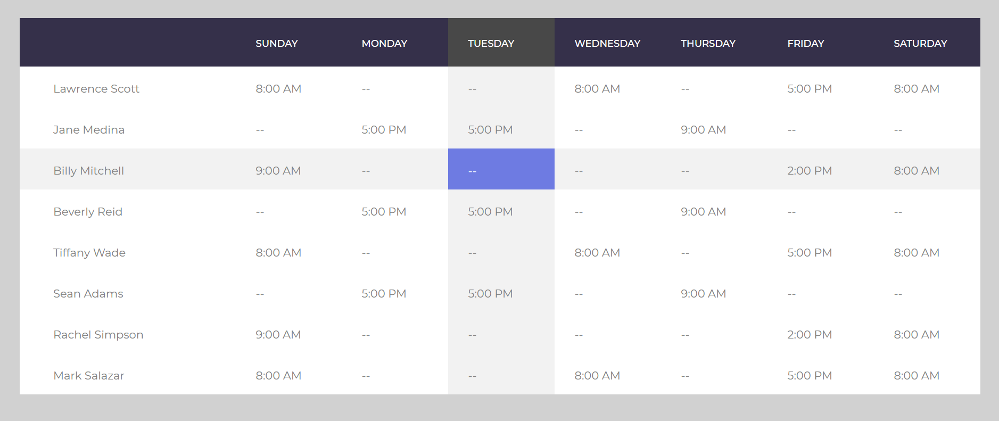
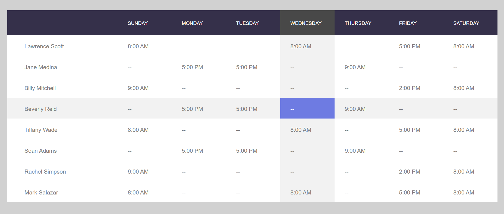

# About

table-highlight is a lighten version of a CSS-based and JS-based HTML table template found at: https://colorlib.com/wp/template/table-with-vertical-horizontal-highlight/.

# Versions

The repo contains 2 versions:
* a **normal** version to integrate into a standard HTML project
* a **flat** and oversimplified version to integrate into [Bonitasoft UIDesigner Custom Widget](https://documentation.bonitasoft.com/bonita/7.10/custom-widgets)

# Samples

## Source code
See [normal sample](normal/sample.html) and [flat sample](flat/sample.html).

## Screenshot
* Normal:

* Flat:

